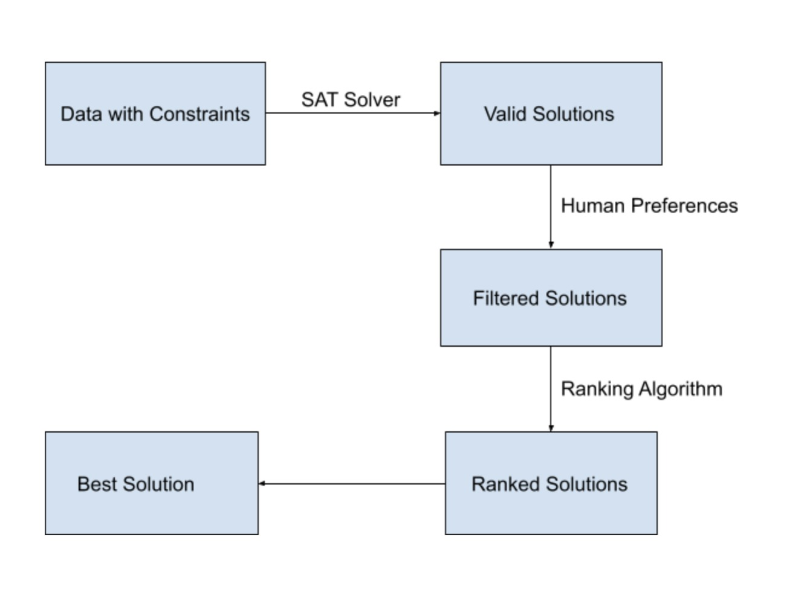

[](https://github.com/ai-se/whun/blob/main/LICENSE) 
[](https://github.com/ai-se/whun/issues)
[](https://arxiv.org/abs/2106.03792)


[](https://app.travis-ci.com/ai-se/whun)
[](https://coveralls.io/github/ai-se/whun?branch=feature-se2021)
# **About SNEAK**
This repository is the official implementation of  SNEAK

AI tools can generate many solutions, some human preference must be applied to determine which solution is
relevant to the current project.One way to find those preferences is interactive search-based software engineering (iSBSE) where
humans can influence the search process. Current iSBSE methods can lead to cognitive fatigue (when they overwhelm humans with
too many overly elaborate questions.SNEAK is an iSBSE algorithm that avoids that problem. Due to its recursive clustering procedure,SNEAK only pesters humans for O(log2N) interactions. Further, each interaction is mediated via a feature selection procedure that reduces the number of asked questions. When compared to prior state-of-the-art iSBSE systems, SNEAK runs faster, asks fewer questions, and achieves better solutions that are within 1% of the best solutions seen in our sample space. More importantly, SNEAK scales to large problems (in our experiments, models with 1000 variables can be explored with half a dozen interactions where, each time, we ask only four questions). Accordingly, we recommend SNEAK as a baseline against which future iSBSE work should be compared.


### **SNEAK Algorithm**

SNEAK is based on data mining and semi-supervised optimization techniques and it can be applied to various different models. Sample models can be obtained from the [Splot Research](http://www.splot-research.org "Splot Research") website. The dataset is required to be binary. For [Splot Research](http://www.splot-research.org "Splot Research") models we can generate our dataset of solutions through PicoSAT, a sat solver capable of producing valid solutions to these CNF-based models. For other models used in this study, please refer to the original paper of these models or to the code provided by Chen et al in their SWAY paper. SNEAK then performs interactions with humans (or with an oracle). In these interactions human preferences are queried to the human, which choses a set of preferences at every step to eliminate many solutions. At the end of this we would be left with roughly 10% of the original data set. However, we need to find a best possible solution. 

For this the paper can apply different strategies towards finding this best possible solution depending on the time-complexity of the objective evaluation function of the chosen model. These strategies are described in our research. The package provided here uses the ''*standard*'' strategy.

### **Flow Chart**
<br />

<br />


### **Steps to use SNEAK Package**
```
from SNEAK import SNEAK
SNEAK.SNEAK_run(['flight_bin.csv'],['flight_eval.csv'])
```
### **GUI for Human Interaction**
Inorder to run SNEAK with human interaction you need to execute the "SNEAK_run" method with the required file name attributes and "is_oracle_method" flag as False.

When the SNEAK_run method executes it will open a window with user interface. User can proceed using the GUI to run SNEAK and choose his/her preferences accordingly.

Below is a sample snippet on how to execute the SNEAK_run method.
```
SNEAK_run(['Scrum10k.csv'], ['flight_eval.csv'], False)
```

To run the method for users for the SCRUM model simply execute from the base folder
```
pip install -r 'requirements.txt'
python \src\whun\sneak.py
```

### **Potential Users**
SNEAK algorithm is meant to be a new baseline for future iSBSE algorithms.

SNEAK can also be used in production code without any warranties and the code is provided as is.


## **Reproducing RQ1** 

### To obtain the scoresheets for RQ1:

Run the two jupyter notebooks as is 
* BASELINE.ipynb 
* NGA.ipynb

also run:
* ``python /src/sneak/rq1.py``

## **Reproducing RQ2 and RQ3**

To obtain the RQ2 and RQ3 results you would need to follow what is described under ``docs/pom3a_tutorial.md``

This was obtained in human trials as described in our paper.

The human experiments were performed in accordance to North Carolina State University's IRB protocol \#24233.


### **References**

* Authors for SNEAK
* Andre Lustosa, Jaydeep Patel, Venkata Sai Teja Malapati, Tim Menzies, Fellow, IEEE

