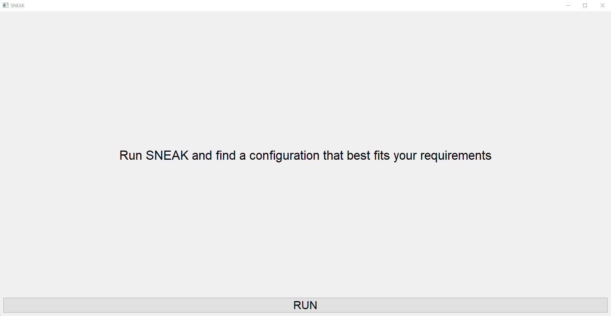
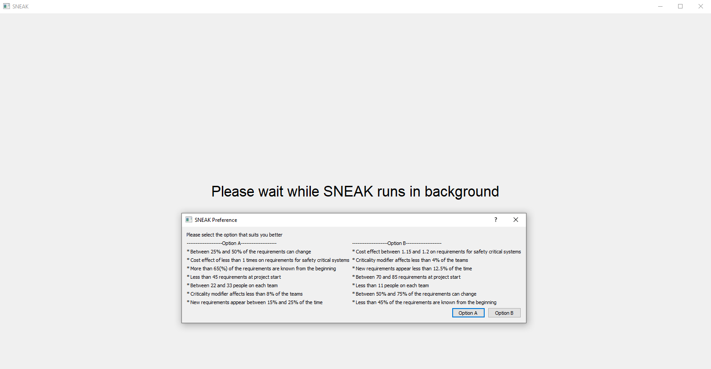
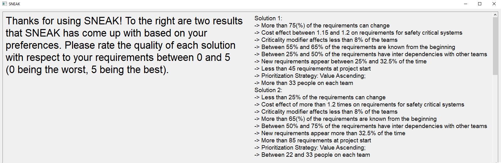

#  Text to participants

## Installation

After cloning this github repo, it is highly recommended to initiate a new virtual environment 

Conda example:
* ``conda create --name sneak``
* ``conda activate sneak``

To install the requirements:

* Navigate to the root of the project
* ``pip install -r "requirements.txt"``

## Introduction
The idea behind the trial is to evaluate the SNEAK algorithm as a tool to help you find a suitable configuration to the POM3A model.

To start the algorithm run the following command at the root of the project:

* ``python \src\whun\sneak.py``

You will then be greeted with the following GUI window:

 

 
 

## Interactions
As the algorithm progresses, it will at times interrupt it's processing to query you for information. You will be shown two options (namely Option A and Option B) as exemplified by the following image.

 

 
 

These two options contain different possible feature configurations from the Model. As we show you these two options we ask you to analyze them, and select the option that most satisfy you (via clicking the buttons of option A or option B). The algorithm will then focus it's search on possible configurations containing the selected options.

Please note that you will not see, throughout the processing of the algorithm, a single complete solution. You should evaluate the options as partial solutions to the model. 

## Final solution
After a number of these queries, you will then be shown two final solutions chosen for you. At this point we would like you to do a final analysis of these solutions and evaluate them on a discrete scale from 0 to 5 (Through the provided link), according to how well you feel these solutions have captured your configuration preferences to the model.

 

 
 

## Bugs
If you encounter any problems, or bugs while running the algorithm, I ask that you stop the process and we will figure out what the problem is.